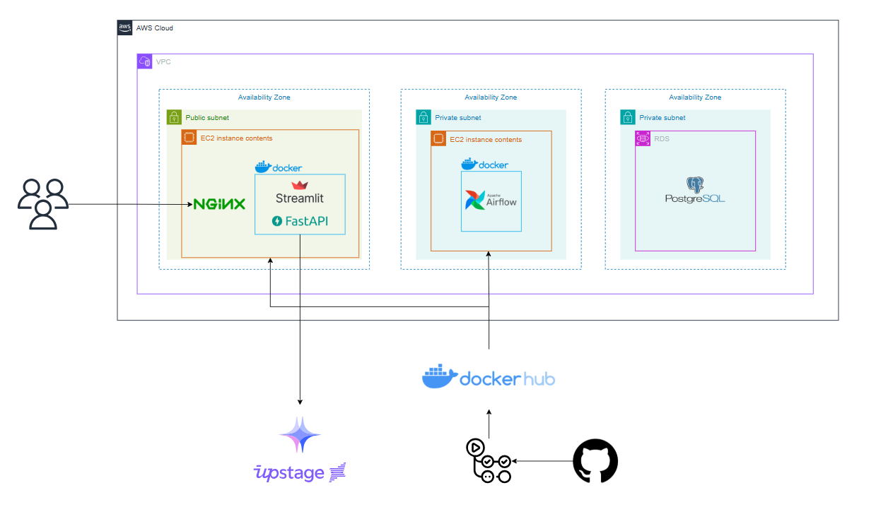

  <h1>📈 KoSTOPnews</h1>
  
기업 관련 뉴스를 수집하고 AI로 감성과 주요 이슈를 분석하는 뉴스 분석 서비스

  <a href="https://kostopnews.duckdns.org/">
    <strong>🔗 KoSTOPnews 바로가기</strong>
  </a>

 
 
 

## 📌 Project Overview

| 항목          | 내용                                    |
| ----------- | ------------------------------------- |
| **프로젝트명**   | KoSTOPnews                            |
| **프로젝트 유형** | 개인 프로젝트                               |
| **목표**      | 기업 관련 뉴스 수집 및 AI 기반 감성·키워드 분석         |
| **주요 기능**   | 뉴스 수집 · 감성 분석 · 키워드 분석 · 기간별 집계 · 시각화 |
| **배포 환경**   | AWS EC2 · RDS                         |

---

## 💡 Project Introduction

기업 관련 뉴스는 여러 매체에 분산되어 있어 필요한 기사를 직접 찾아보고, 여러 기사의 내용을 종합해 주요 이슈와 긍정·부정 흐름을 파악하는 데 시간이 필요합니다.

이러한 과정을 자동화하기 위해 기업별 뉴스를 수집하고, LLM을 활용해 뉴스의 감성과 주요 키워드를 분석한 뒤 기간별로 집계하여 기업 관련 뉴스와 주요 이슈를 한곳에서 확인할 수 있는 KoSTOPnews를 개발했습니다.

---

## 🎯 Goals

* 기업 관련 뉴스 수집 과정 자동화
* LLM을 활용한 뉴스 감성 및 주요 키워드 분석
* 분석 결과를 기간별로 집계하여 제공
* 분석 결과를 사용자가 쉽게 확인할 수 있도록 시각화
* 뉴스 수집부터 AI 분석 및 데이터 집계까지 반복적인 작업 자동화
* AWS 환경에서 지속적으로 서비스를 운영하고 CI/CD 구축

---

## ✨ Main Features

### 📰 기업 뉴스 수집

* RSS를 활용한 기업별 뉴스 자동 수집
* 중복 기사 제거 및 PostgreSQL 저장

### 🤖 AI 뉴스 분석

* LLM을 활용한 뉴스 감성 분석
* 기사별 주요 키워드 추출

### 📊 기간별 분석

* 일간 / 주간 / 월간 감성 집계
* 기간별 주요 키워드 집계

### 📈 대시보드

* 기업별 뉴스 및 감성 분석 결과 조회
* 기간별 감성 흐름 시각화
* 주요 키워드 확인
* 원문 기사 링크 제공

### ⚙️ 자동화 및 운영

* Apache Airflow를 활용한 데이터 파이프라인 자동화
* Docker 기반 서비스 운영
* GitHub Actions를 활용한 CI/CD
* AWS EC2 및 RDS를 활용한 배포

---

## 🏗️ Architecture

  

---

## ⚙️ Tech Stack

| Category           | Technology          |
| ------------------ | ------------------- |
| **Backend**        | FastAPI             |
| **Data Pipeline**  | Apache Airflow      |
| **Frontend**       | Streamlit           |
| **Database**       | PostgreSQL          |
| **LLM**            | Upstage Solar Pro 3 |
| **Infrastructure** | AWS EC2, RDS        |
| **Container**      | Docker              |
| **CI/CD**          | GitHub Actions      |
| **Web Server**     | Nginx               |

---

## 📂 Repositories

| Repository                                    | Description             |
| --------------------------------------------- | ----------------------- |
| [`kostopnews-airflow`](https://github.com/2026-KoSTOPnews/kostopnews-airflow)   | 뉴스 수집 및 AI 분석·집계 파이프라인 |
| [`kostopnews-fastapi`](https://github.com/2026-KoSTOPnews/kostopnews-fastapi)   | 뉴스 분석 결과 조회 API & Streamlit 기반 분석 결과 대시보드 |

---

## 👤 Developer

| Name   | Role                          | Responsibilities                           |
| ------ | ----------------------------- | ------------------------------------------ |
| [**Boyeong-G**](https://github.com/Boyeong-G) | Backend · AI · Infrastructure | 뉴스 수집·분석 파이프라인, API 및 대시보드, AWS 배포 및 CI/CD |

